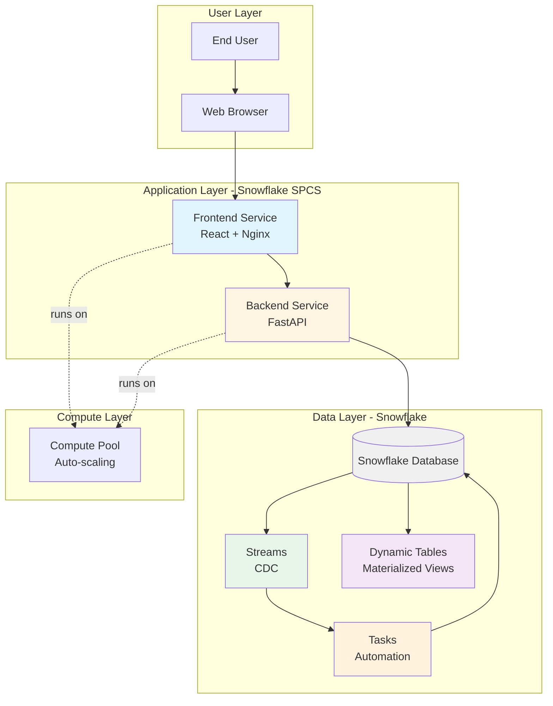
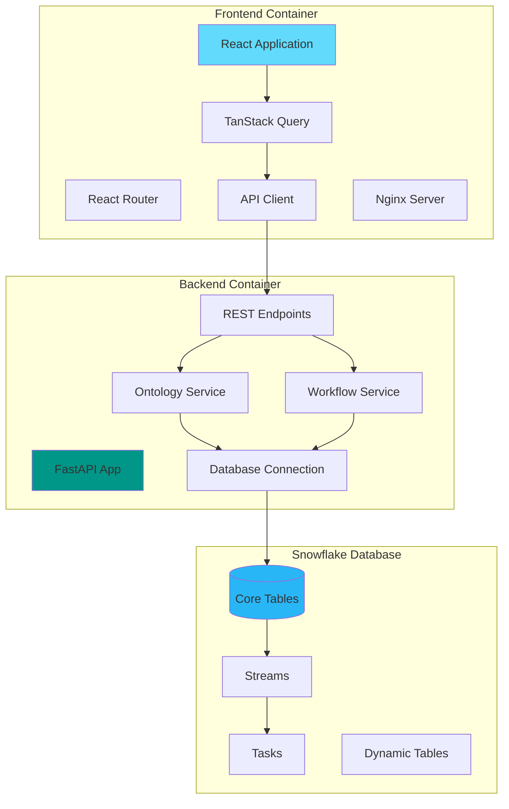
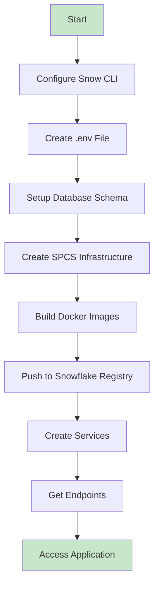
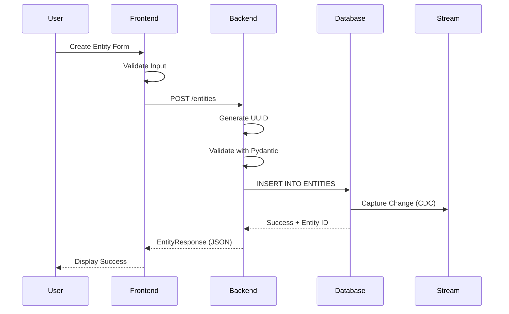
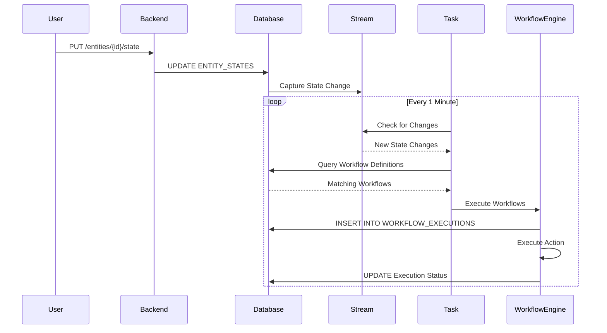

# Snowflake Ontology & Workflow Engine

A sophisticated ontology and workflow layer built natively on Snowflake, transforming a data warehouse into an intelligent knowledge engine. Features a React frontend, Python FastAPI backend, and deploys on Snowflake SPCS.

## 🚀 Quick Start

```bash
# 1. Configure Snowflake connection
snow connection add

# 2. Setup environment
cp .env.example .env
# Edit .env with your Snowflake credentials

# 3. Deploy
./scripts/deploy.sh

# 4. Access
# Frontend: https://[your-endpoint].snowflakecomputing.app
# API Docs: https://[your-endpoint].snowflakecomputing.app/docs
```

## 📋 Table of Contents

1. [Architecture](#architecture)
2. [Features](#features)
3. [Technology Stack](#technology-stack)
4. [Prerequisites](#prerequisites)
5. [Installation](#installation)
6. [Database Schema](#database-schema)
7. [API Endpoints](#api-endpoints)
8. [Deployment](#deployment)
9. [Usage Examples](#usage-examples)
10. [Monitoring](#monitoring)
11. [Troubleshooting](#troubleshooting)

---

## Architecture

### High-Level Architecture



### Three-Layer Design

1. **Semantic Layer (Ontology)**: Entities, relationships, and graph traversal
2. **Logic Layer (Workflow)**: State machine and automated workflows
3. **Compute Layer (Snowflake)**: Streams, Tasks, Dynamic Tables, SPCS

### Component Architecture



---

## Features

### Entity Management
- Create, read, update, delete entities
- Flexible VARIANT properties (JSON)
- Tag-based classification
- Multiple entity types (Customer, Account, Product, etc.)
- Temporal tracking

### Relationship Management
- Subject-Predicate-Object triples (RDF-style)
- Bidirectional relationships
- Property graphs
- Cascade delete handling

### Graph Operations
- Recursive graph traversal
- Configurable depth and direction
- Relationship type filtering
- Graph statistics and analytics

### Workflow Engine
- State-based triggers
- Multiple action types (SQL, Python, Notification)
- Execution history
- Enable/disable control
- Automatic triggering via Streams and Tasks

### User Interface
- Interactive dashboard with charts
- Entity management interface
- Relationship builder
- Graph visualization
- Workflow configuration
- Real-time updates

---

## Technology Stack

### Backend
- **Python 3.11**: Core language
- **FastAPI**: Async web framework
- **Snowflake Connector**: Database access
- **Snowpark**: Advanced Snowflake operations
- **Pydantic**: Data validation
- **Uvicorn**: ASGI server

### Frontend
- **React 18**: UI framework
- **TypeScript**: Type safety
- **Vite**: Build tool
- **TanStack Query**: Server state management
- **Recharts**: Data visualization
- **Axios**: HTTP client
- **Lucide React**: Icons

### Infrastructure
- **Snowflake SPCS**: Container services
- **Docker**: Containerization
- **Nginx**: Web server
- **Snow CLI**: Deployment tool

---

## Prerequisites

1. **Snowflake Account** with ACCOUNTADMIN role
2. **Snow CLI** installed:
   ```bash
   pip install snowflake-cli-labs
   ```
3. **Docker** installed and running
4. **Node.js 20+** (for local frontend development)
5. **Python 3.11+** (for local backend development)

---

## Installation

### Option 1: Deploy to Snowflake SPCS (Production)

```bash
# 1. Configure Snow CLI
snow connection add

# 2. Create environment file
cp .env.example .env
# Edit .env with your Snowflake credentials

# 3. Make scripts executable
chmod +x scripts/*.sh

# 4. Deploy to SPCS
./scripts/deploy.sh

# 5. Access via endpoints shown at the end
```

### Option 2: Local Development

```bash
# 1. Configure Snow CLI
snow connection add

# 2. Create environment file
cp .env.example .env

# 3. Run local development
./scripts/local_dev.sh

# 4. Access
# Frontend: http://localhost
# Backend API: http://localhost:8000
# API Docs: http://localhost:8000/docs
```

---

## Database Schema

### Entity-Relationship Diagram

```mermaid
erDiagram
    ENTITIES ||--o{ RELATIONSHIPS : "subject"
    ENTITIES ||--o{ RELATIONSHIPS : "object"
    ENTITIES ||--o| ENTITY_STATES : "has"
    ENTITIES ||--o{ WORKFLOW_EXECUTIONS : "triggers"
    WORKFLOW_DEFINITIONS ||--o{ WORKFLOW_EXECUTIONS : "defines"
    
    ENTITIES {
        varchar entity_id PK
        varchar entity_type
        varchar label
        variant properties
        variant tags
        timestamp created_at
        timestamp updated_at
    }
    
    RELATIONSHIPS {
        varchar relationship_id PK
        varchar subject_id FK
        varchar predicate
        varchar object_id FK
        variant properties
        timestamp created_at
    }
    
    ENTITY_STATES {
        varchar entity_id PK_FK
        varchar current_state
        varchar previous_state
        variant state_data
        timestamp updated_at
    }
    
    WORKFLOW_DEFINITIONS {
        varchar workflow_id PK
        varchar name
        text description
        varchar trigger_condition
        varchar action_type
        variant action_config
        boolean enabled
        timestamp created_at
    }
    
    WORKFLOW_EXECUTIONS {
        varchar execution_id PK
        varchar workflow_id FK
        varchar entity_id FK
        varchar status
        variant input_data
        variant output_data
        text error_message
        timestamp started_at
        timestamp completed_at
    }
```

### Core Tables

- **ENTITIES**: Stores all entities with flexible VARIANT properties
- **RELATIONSHIPS**: Subject-Predicate-Object triples for graph
- **ENTITY_STATES**: Current state for workflow management
- **WORKFLOW_DEFINITIONS**: Workflow configurations
- **WORKFLOW_EXECUTIONS**: Workflow execution history

### Snowflake Features

- **Streams**: CDC on entities and states (ENTITIES_STREAM, ENTITY_STATES_STREAM)
- **Tasks**: Automated workflow processing (PROCESS_STATE_CHANGES)
- **Dynamic Tables**: Materialized views (ENTITY_RELATIONSHIP_SUMMARY, WORKFLOW_EXECUTION_SUMMARY)
- **Views**: Convenient query interfaces (V_ENTITY_GRAPH, V_ENTITIES_WITH_STATE)

---

## API Endpoints

### Entity Management

| Method | Endpoint | Description |
|--------|----------|-------------|
| POST | `/entities` | Create entity |
| GET | `/entities` | List entities (with filters) |
| GET | `/entities/{id}` | Get entity by ID |
| PUT | `/entities/{id}` | Update entity |
| DELETE | `/entities/{id}` | Delete entity |

### Relationship Management

| Method | Endpoint | Description |
|--------|----------|-------------|
| POST | `/relationships` | Create relationship |
| GET | `/relationships` | List relationships (with filters) |
| DELETE | `/relationships/{id}` | Delete relationship |

### Graph Operations

| Method | Endpoint | Description |
|--------|----------|-------------|
| POST | `/graph/query` | Query graph with recursive traversal |
| GET | `/graph/stats` | Get graph statistics |

### Workflow Management

| Method | Endpoint | Description |
|--------|----------|-------------|
| POST | `/workflows` | Create workflow definition |
| GET | `/workflows` | List workflows |
| GET | `/workflows/{id}` | Get workflow |
| POST | `/workflows/{id}/execute` | Execute workflow manually |
| GET | `/workflows/executions` | List executions |

### State Management

| Method | Endpoint | Description |
|--------|----------|-------------|
| GET | `/entities/{id}/state` | Get entity state |
| PUT | `/entities/{id}/state` | Update state (triggers workflows) |

### System

| Method | Endpoint | Description |
|--------|----------|-------------|
| GET | `/` | Root endpoint |
| GET | `/health` | Health check |

---

## Deployment

### Deployment Flow



### Infrastructure Components

- **Compute Pool**: ONTOLOGY_COMPUTE_POOL (CPU_X64_S, 1-3 nodes, auto-suspend)
- **Image Repository**: ONTOLOGY_IMAGES
- **Services**: Backend (FastAPI) and Frontend (React/Nginx)
- **Database**: ONTOLOGY_DB with all tables, streams, tasks
- **Network Rules**: External access for Snowflake API
- **Endpoints**: Public HTTPS endpoints for both services

### Deployment Commands

```bash
# Deploy everything
./scripts/deploy.sh

# Teardown (remove all resources)
./scripts/teardown.sh

# Validate setup before deployment
./scripts/validate.sh

# Local development
./scripts/local_dev.sh
```

---

## Usage Examples

### Create an Entity

```bash
curl -X POST http://localhost:8000/entities \
  -H "Content-Type: application/json" \
  -d '{
    "entity_type": "CUSTOMER",
    "label": "Acme Corporation",
    "properties": {"industry": "Technology", "size": "Enterprise"},
    "tags": ["premium", "tech"]
  }'
```

### Create a Relationship

```bash
curl -X POST http://localhost:8000/relationships \
  -H "Content-Type: application/json" \
  -d '{
    "subject_id": "customer-001",
    "predicate": "OWNS",
    "object_id": "account-001",
    "properties": {}
  }'
```

### Query the Graph

```bash
curl -X POST http://localhost:8000/graph/query \
  -H "Content-Type: application/json" \
  -d '{
    "start_entity_id": "customer-001",
    "max_depth": 3,
    "direction": "both"
  }'
```

### Create a Workflow

```bash
curl -X POST http://localhost:8000/workflows \
  -H "Content-Type: application/json" \
  -d '{
    "name": "Customer At-Risk Alert",
    "description": "Triggers when customer becomes at-risk",
    "trigger_condition": "AT_RISK",
    "action_type": "NOTIFICATION",
    "action_config": {"message": "Customer needs attention"},
    "enabled": true
  }'
```

### Update Entity State (Triggers Workflows)

```bash
curl -X PUT "http://localhost:8000/entities/customer-001/state?new_state=AT_RISK" \
  -H "Content-Type: application/json" \
  -d '{"health_score": 45}'
```

### Data Flow: Entity Creation



### Data Flow: Workflow Trigger



---

## Monitoring

### Check Service Status

```bash
# List services
snow sql -q "SHOW SERVICES IN DATABASE ONTOLOGY_DB;"

# Get service details
snow sql -q "DESCRIBE SERVICE ONTOLOGY_DB.PUBLIC.ONTOLOGY_BACKEND_SERVICE;"

# Check service status
snow sql -q "SELECT SYSTEM\$GET_SERVICE_STATUS('ONTOLOGY_DB.PUBLIC.ONTOLOGY_BACKEND_SERVICE');"
```

### View Logs

```bash
# Backend logs
snow sql -q "CALL SYSTEM\$GET_SERVICE_LOGS('ONTOLOGY_DB.PUBLIC.ONTOLOGY_BACKEND_SERVICE', 0, 'backend', 100);"

# Frontend logs
snow sql -q "CALL SYSTEM\$GET_SERVICE_LOGS('ONTOLOGY_DB.PUBLIC.ONTOLOGY_FRONTEND_SERVICE', 0, 'frontend', 100);"
```

### Monitor Resources

```sql
-- Compute pool usage
SELECT * FROM TABLE(INFORMATION_SCHEMA.COMPUTE_POOL_HISTORY(
  COMPUTE_POOL_NAME => 'ONTOLOGY_COMPUTE_POOL'
));

-- Service metrics
SELECT * FROM TABLE(INFORMATION_SCHEMA.SERVICE_HISTORY(
  SERVICE_NAME => 'ONTOLOGY_BACKEND_SERVICE'
));

-- Query database
USE DATABASE ONTOLOGY_DB;
SELECT * FROM ENTITIES;
SELECT * FROM V_ENTITY_GRAPH;
SELECT * FROM WORKFLOW_EXECUTIONS;
```

### Local Development Logs

```bash
# View all logs
docker-compose logs -f

# Backend only
docker-compose logs -f backend

# Frontend only
docker-compose logs -f frontend
```

---

## Troubleshooting

### Services Not Starting

```bash
# 1. Check service status
snow sql -q "SELECT SYSTEM\$GET_SERVICE_STATUS('ONTOLOGY_DB.PUBLIC.ONTOLOGY_BACKEND_SERVICE');"

# 2. View logs
snow sql -q "CALL SYSTEM\$GET_SERVICE_LOGS('ONTOLOGY_DB.PUBLIC.ONTOLOGY_BACKEND_SERVICE', 0, 'backend', 100);"

# 3. Check compute pool
snow sql -q "DESCRIBE COMPUTE POOL ONTOLOGY_COMPUTE_POOL;"

# 4. Verify images
snow sql -q "SHOW IMAGES IN IMAGE REPOSITORY ONTOLOGY_DB.PUBLIC.ONTOLOGY_IMAGES;"
```

### Connection Issues

```bash
# Test Snow CLI connection
snow connection test

# Check credentials
cat ~/.snowflake/config.toml

# Test SQL query
snow sql -q "SELECT CURRENT_USER();"
```

### Docker Issues

```bash
# Check Docker is running
docker ps

# Rebuild images
cd backend && docker build -t ontology-backend:latest .
cd frontend && docker build -t ontology-frontend:latest .

# Check logs
docker-compose logs -f
```

### Database Errors

```sql
-- Verify database exists
SHOW DATABASES LIKE 'ONTOLOGY_DB';

-- Check tables
USE DATABASE ONTOLOGY_DB;
SHOW TABLES;

-- Verify sample data
SELECT * FROM ENTITIES;
SELECT * FROM RELATIONSHIPS;
```

### Common Issues

| Issue | Solution |
|-------|----------|
| "Snow CLI not found" | `pip install snowflake-cli-labs` |
| "Docker not running" | Start Docker Desktop or `sudo systemctl start docker` |
| "Connection failed" | Run `snow connection test` and verify credentials |
| "Permission denied" | Run `chmod +x scripts/*.sh` |
| "Port already in use" | Stop existing containers with `docker-compose down` |

---

## Project Structure

```
snowflake-ontology/
├── backend/                    # Python FastAPI backend
│   ├── services/              # Business logic
│   │   ├── ontology_service.py
│   │   └── workflow_service.py
│   ├── main.py               # FastAPI application
│   ├── models.py             # Pydantic models
│   ├── database.py           # Snowflake connection
│   ├── config.py             # Configuration
│   ├── requirements.txt      # Python dependencies
│   └── Dockerfile            # Backend container
├── frontend/                  # React TypeScript frontend
│   ├── src/
│   │   ├── api/             # API client
│   │   ├── pages/           # UI pages
│   │   ├── App.tsx          # Main app
│   │   └── main.tsx         # Entry point
│   ├── package.json         # Node dependencies
│   ├── Dockerfile           # Frontend container
│   └── nginx.conf           # Web server config
├── sql/                      # Database schemas
│   └── setup_database.sql   # Complete DB setup
├── spcs/                     # SPCS service specs
│   ├── service_spec_backend.yaml
│   └── service_spec_frontend.yaml
├── scripts/                  # Deployment scripts
│   ├── deploy.sh            # SPCS deployment
│   ├── local_dev.sh         # Local development
│   ├── teardown.sh          # Cleanup
│   ├── validate.sh          # Pre-deployment checks
│   └── setup_spcs.sql       # SPCS infrastructure
├── docker-compose.yml        # Local development
├── snowflake.yml            # Snowflake CLI config
├── .env.example             # Config template
├── CONSOLIDATED_DOCUMENTATION.md  # Detailed docs
├── CURRENT_URL.md           # Deployment URLs
└── README.md                # This file
```

---

## Security Considerations

1. **Credentials**: Never commit `.env` files. Use Snowflake Secrets for production.
2. **Network Rules**: Configure appropriate egress rules for SPCS services.
3. **Role-Based Access**: Use least-privilege Snowflake roles.
4. **API Authentication**: Add OAuth2/JWT for production (not yet implemented).
5. **HTTPS**: SPCS endpoints use HTTPS by default.
6. **Input Validation**: All inputs validated with Pydantic.
7. **SQL Injection**: Parameterized queries prevent SQL injection.

---

## Performance Optimization

1. **Indexes**: Created on frequently queried columns (entity_type, subject_id, object_id, etc.)
2. **Dynamic Tables**: Pre-computed aggregations for dashboard statistics
3. **Query Optimization**: Efficient recursive CTEs for graph traversal
4. **Caching**: Frontend uses TanStack Query for client-side caching
5. **Connection Pooling**: Backend manages database connections efficiently
6. **Auto-Scaling**: SPCS services scale from 1-3 instances based on load
7. **Compute Pool**: Auto-suspends after 1 hour to save costs

---

## Future Enhancements

- [ ] Authentication & authorization (OAuth2/JWT)
- [ ] Real-time updates via WebSockets
- [ ] Advanced graph visualization with D3.js
- [ ] ML-powered entity matching and recommendations
- [ ] Multi-tenancy support
- [ ] Audit logging and compliance features
- [ ] Advanced workflow orchestration
- [ ] Integration with external systems
- [ ] Mobile app
- [ ] GraphQL API

---

## Use Cases

- **Customer 360**: Unified customer view with all relationships
- **Supply Chain**: Track products, suppliers, and dependencies
- **Knowledge Management**: Build organizational knowledge graphs
- **Data Lineage**: Track data flow and transformations
- **Compliance**: Model regulatory requirements and dependencies
- **Master Data Management**: Central entity registry
- **Fraud Detection**: Identify suspicious relationship patterns
- **Recommendation Engine**: Graph-based recommendations

---

## Contributing

This is a demonstration project. For production use, consider:
- Adding comprehensive tests (unit, integration, e2e)
- Implementing proper error handling
- Adding monitoring and alerting (Prometheus, Grafana)
- Implementing backup and disaster recovery
- Adding CI/CD pipelines
- Implementing rate limiting and API gateway

---

## License

This project is provided as-is for educational and demonstration purposes.

---

## Support

- **Snowflake Documentation**: https://docs.snowflake.com
- **Snowflake Community**: https://community.snowflake.com
- **FastAPI Documentation**: https://fastapi.tiangolo.com
- **React Documentation**: https://react.dev

---

## Additional Documentation

- **CONSOLIDATED_DOCUMENTATION.md**: Complete documentation with all Mermaid diagrams
- **CURRENT_URL.md**: Current deployment URLs and status

---

**Built with ❄️ on Snowflake**

Last Updated: January 30, 2026
